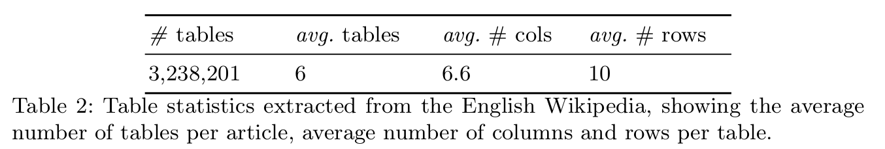
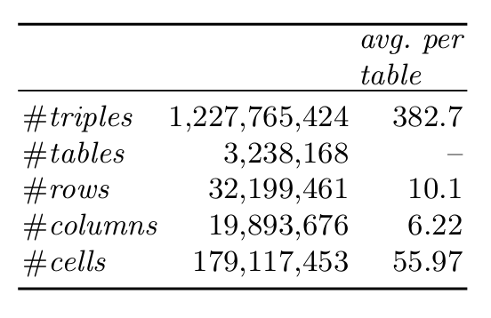
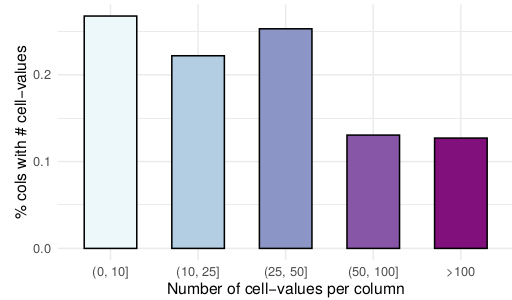
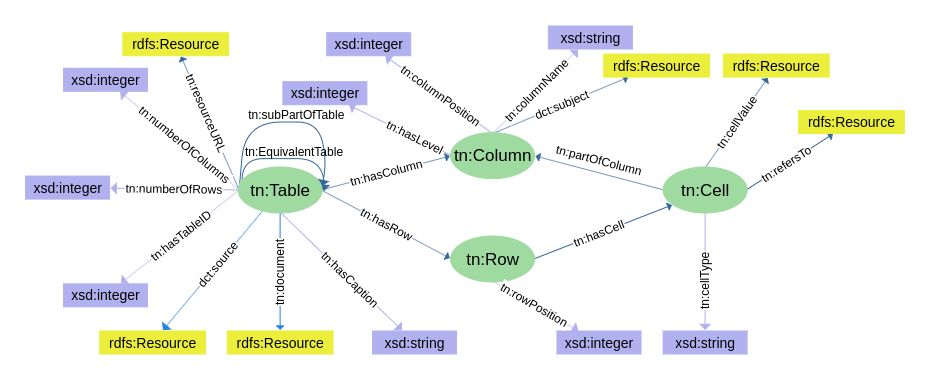
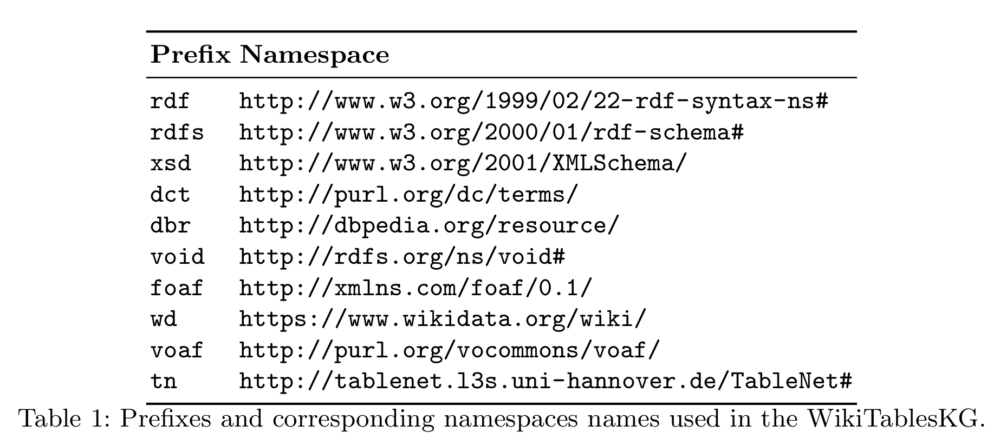

# WikiTablesKG - The Knowledge Graph of Wikipedia Tables
This repository describes the WikiTablesKG resource. WikiTablesKG along with its accompanying code used for extraction and
representation, and mapping of tables are available for download, under the license Attribution-ShareAlike 4.0 International (CC BY-SA 4.0).

Our dataset consists of tables extracted from the English Wikipedia with more than 5M articles. We extract more than 3M tables from the Wikipedia articles’ HTML content. From the 5M articles only 529k articles contain tables. The following table shows the statistics of the extracted tables.

## WikiTablesKG Statistics
The following table  presents an overview of the number of tables, rows, columns, and cells that are present as
resources in WikiTablesKG, defined according to the WikiTablesKG ontology. In terms of column representation, we distinguished between three types, which were defined according to the cell-values present in a column. 56.2% of the columns are of type literal, whereas the remaining 43.8% contain cell-values that are instances, for which we correspondingly can infer LCA categories. That is, in the case when the column has more than two cell-values that are instances. Otherwise, the column type can be interpreted by mapping instances to existing type taxonomies (e.g. DBpedia).

## WikiTablesKG Schema
We define four mainclasses, namely, Table, Column, Row and Cell, representing the building blocks of a Web table. 
In the following  picture the predicates are depicted as directed arrows, with the starting point denoting its domain, whereas the end point denotes its range. 

Following are the prefixes used in the WikiTablesKG schema.

# Resource Overview
WikiTablesKG is composed of the following resources, which can be accessed
through the provided links:

### WikiTablesKG Ontology
WikiTablesKG ontology is provided as an OWL [file](ontology.owl).

### WikiTablesKG Metadata
WikiTablesKG metadata is provided as an RDF turtle [file](metadata.ttl).  

### WikiTablesKG RDF Dumps

The RDF dumps (split into several files) is provided in RDF turtle format [dump](http://l3s.de/~fetahu/wikitables_kg/rdf_dumps/) 

### WikiTablesKG SPARQL Endpoint
You can have query access in the WikiTablesKG via our Virtuoso SPARQL Endpoint [here](http://www.tablenet.l3s.uni-hannover.de/sparql).
